<p align="center">
  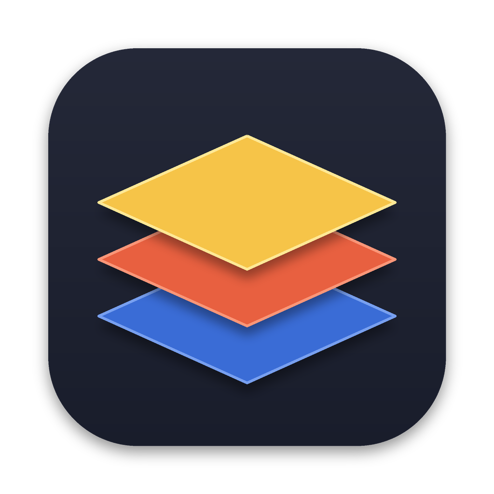
</p>

<h1 align="center">Pixelferrite</h1>

<p align="center">
  <b>A light, Pixelmator-style image editor with AI painting, written in Rust.</b><br>
  Layers, masks, brushes, smart selections, text on a path and a shelf of filters,<br>
  plus one menu item that hands any part of the picture to an image model and gets a new layer back.
</p>

<p align="center">
  
  
  
  
</p>

<br>

<p align="center">
  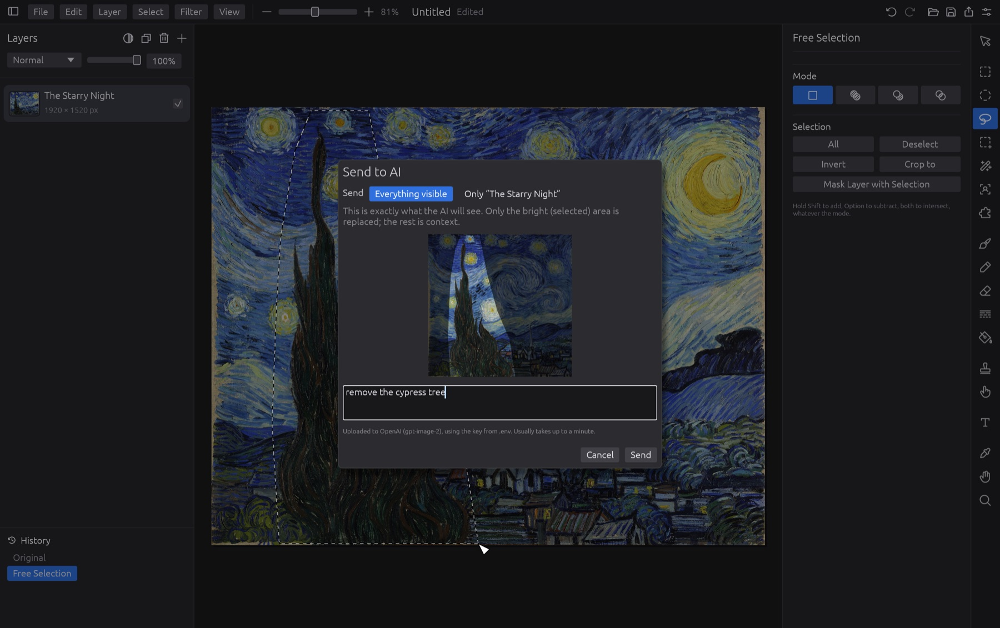
  <br>
  <sub>Lasso the cypress, say what you want, and see exactly what will be sent before it goes.<br>
  <i>The Starry Night</i>, Vincent van Gogh, 1889</sub>
</p>

<p align="center">
  <a href="#paint-with-a-prompt">AI painting</a> ·
  <a href="#select-what-you-mean">Selections</a> ·
  <a href="#type-filters-and-geometry">Type &amp; filters</a> ·
  <a href="#built-for-agents">Agents</a> ·
  <a href="#everything-in-the-box">Everything in the box</a> ·
  <a href="#get-started">Get started</a> ·
  <a href="#under-the-hood">Under the hood</a> ·
  <a href="#reference">Reference</a>
</p>

<br>

<table>
  <tr>
    <td width="25%" valign="top">
      <h3>Small on purpose</h3>
      The tools you reach for every day, in the places a Pixelmator user expects them: layers on the left, tools on the right, options beside them. A compact Rust engine and native interface.
    </td>
    <td width="25%" valign="top">
      <h3>AI where you point</h3>
      Select an area, type a prompt, and the answer lands as a new layer cut to your selection. Erase things, add things, or extend a picture past its edges.
    </td>
    <td width="25%" valign="top">
      <h3>Native and quick</h3>
      One binary drawn on the GPU through wgpu. No Electron, no web view, and the computer-vision filters are plain Rust, so there is nothing else to install.
    </td>
    <td width="25%" valign="top">
      <h3>Open files</h3>
      Editable documents use OpenRaster (<code>.ora</code>). Export to PNG, JPEG, GIF or a compatible ORA with masks baked in.
    </td>
  </tr>
</table>

<br>

Every screenshot here is the real app at work on public-domain art, driven and rendered offscreen by the test
harness in [`demo.rs`](crates/pixelferrite/src/demo.rs). The AI results are real answers from the model, unretouched.

## Paint with a prompt

**Layer > Send to AI with Prompt…** sends what you are looking at to OpenAI's image model. With a selection, only
that area is replaced and the rest of the picture goes along as context, so the new pixels match the brushwork,
light and colour around them.

<table>
  <tr>
    <td width="50%" valign="top">
      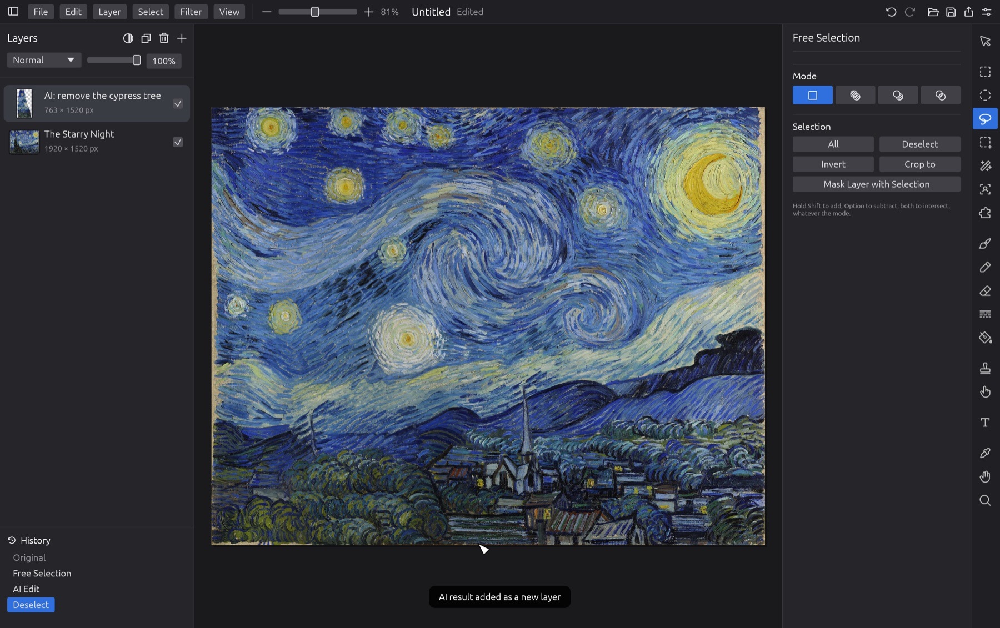
      <br>
      <sub>The answer to the prompt above, as its own layer over the untouched original.<br><i>The Starry Night</i>, Vincent van Gogh, 1889</sub>
      <h3>Erase it</h3>
      "Remove the cypress tree." The sky, the hills and the village carry on where it stood. The result is a separate layer cut to the selection, so the original is still underneath: hide it, mask it or throw it away.
    </td>
    <td width="50%" valign="top">
      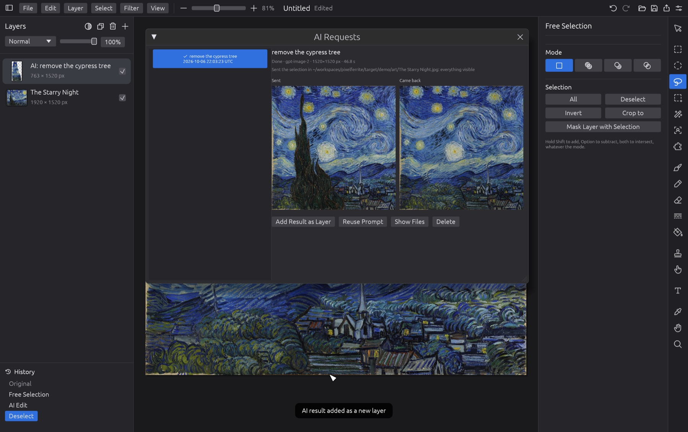
      <br>
      <sub>Layer > AI Requests…: what was sent, what came back, and how long it took.</sub>
      <h3>Keep the receipts</h3>
      When history is enabled, requests are saved with their prompt, source image, mask, answer and exact inserted layer. Add an old result back as a layer, reuse a prompt, or open the files.
    </td>
  </tr>
  <tr>
    <td width="50%" valign="top">
      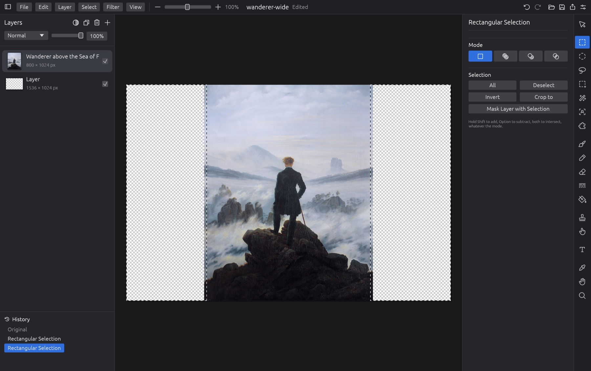
      <br>
      <sub>A portrait painting on a landscape canvas, with the empty sides selected.<br><i>Wanderer above the Sea of Fog</i>, Caspar David Friedrich, c. 1818</sub>
      <h3>Go past the frame</h3>
      Put a picture on a bigger canvas and select the empty part. Give it a hint, or leave the prompt blank to simply continue what is there.
    </td>
    <td width="50%" valign="top">
      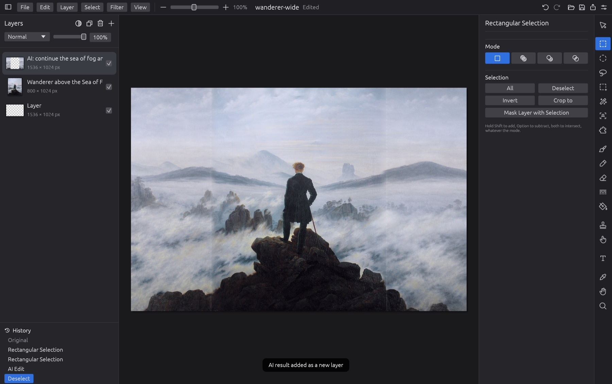
      <br>
      <sub>"Continue the sea of fog and the distant peaks." The wanderer himself is not touched.</sub>
      <h3>And it keeps going</h3>
      The fog and ridges run out to both edges. Look closely and you can find the join on the left; the new part is a layer of its own, so a soft eraser or a mask tidies it up.
    </td>
  </tr>
</table>

You bring your own OpenAI key (File > Settings, or a `.env` file). Each request is one paid API call and the picture
is uploaded to the destination shown in the prompt dialog; nothing is sent until you press Send.

## Select what you mean

<table>
  <tr>
    <td width="50%" valign="top">
      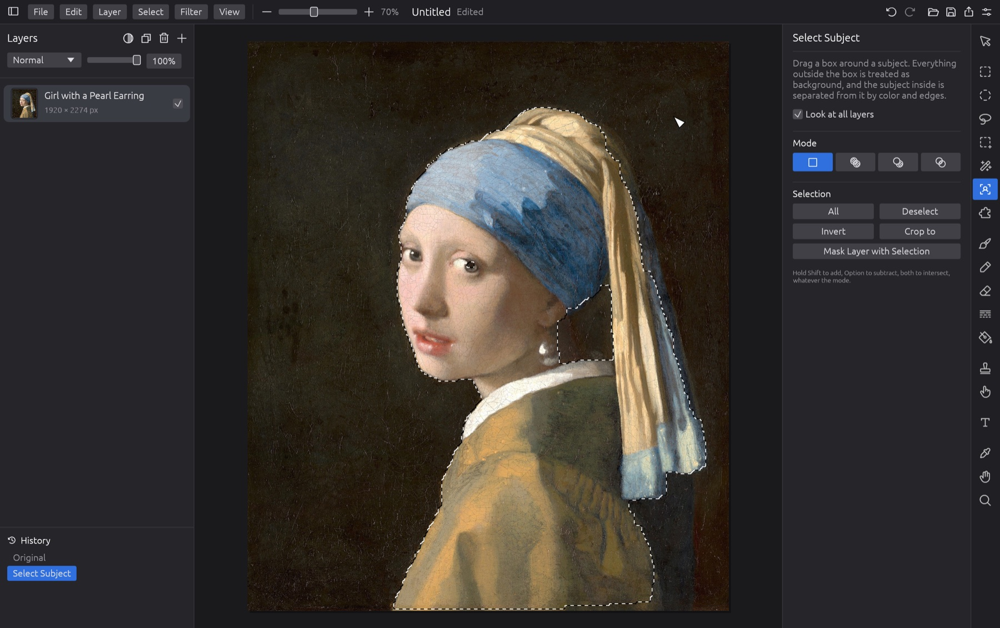
      <br>
      <sub>Select Subject: one dragged box, and the outline finds her.<br><i>Girl with a Pearl Earring</i>, Johannes Vermeer, c. 1665</sub>
      <h3>One box, one subject</h3>
      <b>Select Subject</b> (U) separates what is inside your box from the background by colour and edges. <b>Region Selection</b> (Y) picks an area up to its edges with a click, and the <b>magic wand</b>, <b>quick selection</b>, lasso, rectangle and ellipse are all here too.
    </td>
    <td width="50%" valign="top">
      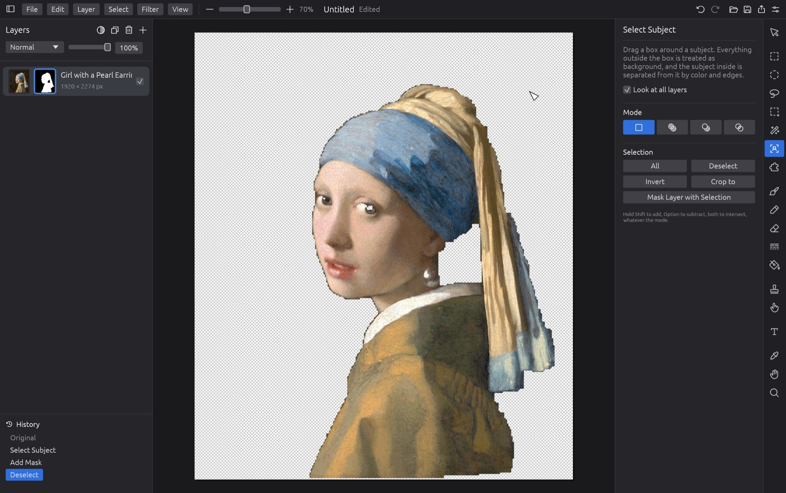
      <br>
      <sub>Mask Layer with Selection: the background is hidden, not deleted.</sub>
      <h3>Cut out, without cutting</h3>
      Turn any selection into a layer mask and paint on the mask to refine it. Every selection tool adds, subtracts and intersects, with buttons or with Shift and Option.
    </td>
  </tr>
</table>

## Type, filters and geometry

<table>
  <tr>
    <td colspan="2" valign="top">
      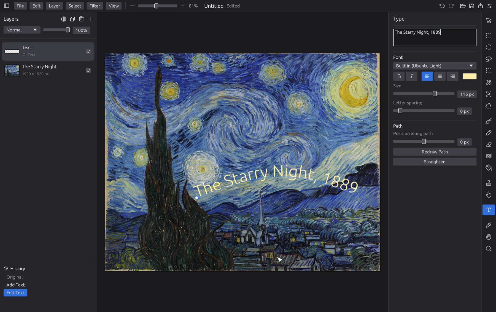
      <br>
      <sub>Drag with the Type tool to draw a path; the text follows it and stays editable.</sub>
      <h3>Text that follows a line</h3>
      Click to place text, or drag to draw the line it runs along. Any installed font, with size, spacing, alignment and colour. A selection's outline can become the path too, so text can wrap around whatever you selected.
    </td>
  </tr>
  <tr>
    <td width="50%" valign="top">
      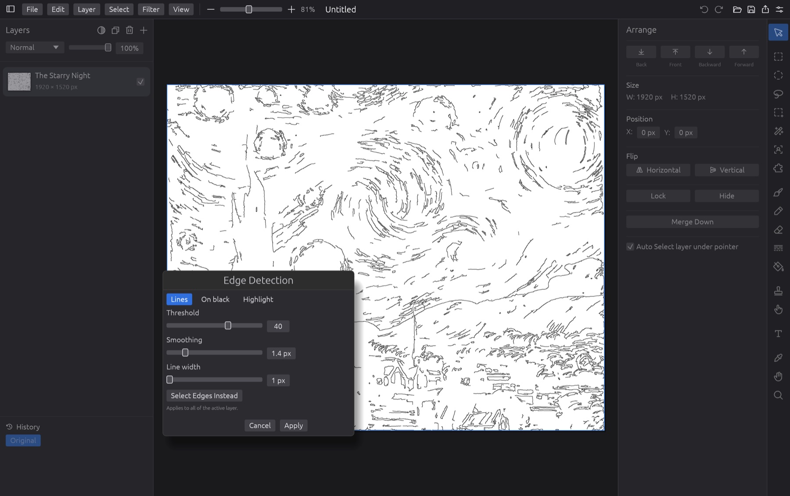
      <br>
      <sub>Edge Detection turning brush strokes into line art, previewed live.</sub>
      <h3>Filters you can watch</h3>
      Every filter previews on the canvas while you move its sliders. Blur and sharpen, heal a selection, reduce noise, fix contrast, match one picture's colours to another, or trace the edges.
    </td>
    <td width="50%" valign="top">
      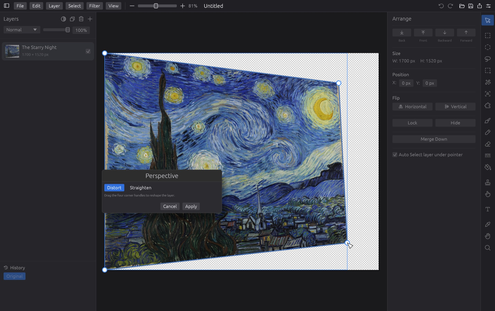
      <br>
      <sub>Perspective: four handles on the canvas, Distort or Straighten.</sub>
      <h3>Bend it, or straighten it</h3>
      Drag four corners to put a picture into perspective, or mark the corners of a photographed page and pull it square. Lens correction and content-aware scaling live in the same menu.
    </td>
  </tr>
</table>

## Built for agents

`pixelferrite mcp` is a [Model Context Protocol](https://modelcontextprotocol.io) server. Point Claude Code or any
other MCP client at it and say what you want: "remove the red eye in this photo", "cut out the dog and put it on the
beach layer", "set the title along the top of the arch". The agent looks at the picture, zooms in on the part it
cares about, runs editor commands and checks its own work with another screenshot.

If a Pixelferrite window is open, the agent edits **that document, live**: you watch the selection appear and the
pixels change, every command is an ordinary undo step, and ⌘Z takes back anything you don't like. With no window
open it works headless on files.

```sh
claude mcp add pixelferrite -- /path/to/pixelferrite mcp
```

For the Mac app that path is `dist/Pixelferrite.app/Contents/MacOS/pixelferrite`. The buttons in the window and the
commands an agent sends run the same engine code. See [MCP](#mcp) for the tools and the security model.

## Everything in the box

| | |
|---|---|
| **Layers** | Blend modes, opacity, masks, reorder, merge, duplicate, flip, lock and hide; undo and redo with a history list |
| **Paint** | Brush, pencil, eraser, gradient, fill, clone stamp, smudge, colour picker |
| **Select** | Rectangle, ellipse, lasso, quick selection, magic wand, Select Subject, Region Selection; add, subtract, intersect |
| **Type** | Straight or along a path, system fonts, editable after saving |
| **Filters** | Gaussian and surface blur, sharpen, heal, reduce noise, auto contrast, equalize, local contrast, threshold, match colours, perspective, lens distortion, content-aware scale, edge detection |
| **AI** | Edit a selection, restyle a whole image, extend past the edges; request history |
| **Agents** | MCP server that drives the open window or works headless on files; every edit an undo step |
| **Canvas** | Pinch to zoom, two-finger rotate, a zoom slider in the toolbar |
| **Files** | OpenRaster `.ora` documents; opens and inserts PNG, JPEG, GIF, WebP and more; exports PNG, JPEG, GIF |

It is a light take on the idea, not a replacement: there are no adjustment layers, layer styles, shapes, RAW
development or colour management yet, and text is typed in the side panel instead of on the canvas.

## Get started

You need [Rust](https://rustup.rs) 1.98.0, pinned in `rust-toolchain.toml`. Builds and checks use `Cargo.lock`.

```sh
git clone https://github.com/base698/pixelferrite
cd pixelferrite
cargo run --release --locked -p pixelferrite                # empty canvas
cargo run --release --locked -p pixelferrite -- photo.jpg   # open a picture
```

**macOS:** `./scripts/bundle-macos.sh` builds `dist/Pixelferrite.app` and puts a shortcut on the Desktop. The app is
built for your own machine and signed ad hoc; it is not notarized for handing to others.

**Build identity:** open **Help > About Pixelferrite** to see the version, full commit, source status,
target and build profile. **Copy build info** copies these details for test reports; `pixelferrite --version`
prints the same information. The identity is embedded at compile time. Local changes are flagged, and
builds without Git metadata show Unknown rather than claiming a commit.

**Linux:** the same commands, with the usual winit and wgpu system packages (X11 or Wayland development libraries
and a Vulkan or GL driver), plus FreeType and fontconfig development packages for window titles. File dialogs go through the XDG desktop portal. Development so far has been on macOS, so
expect rough edges and please report them.

**AI edits** need an OpenAI key. Put it in File > Settings, or in a `.env` file next to where you run the app:

```
OPENAI_API_KEY=sk-...
```

## Under the hood

- **`crates/pf-core`**: the engine. Document model, compositor, painting, selections, text, filters and file
  formats, with no GUI dependency and its own headless tests.
- **`crates/pixelferrite`**: the app, built on [egui](https://github.com/emilk/egui) and eframe, drawn with wgpu
  (Metal on macOS, Vulkan or GL on Linux).

The vision algorithms are the classics, written in Rust instead of linked from OpenCV: Canny edges, bilateral
and non-local-means smoothing, CLAHE, GrabCut, watershed, seam carving and homography warps.

```sh
cargo test --workspace --locked   # engine and application tests; no paid API calls
```

The README screenshots come from the same harness. With the three paintings in a folder:

```sh
PF_DEMO_ART=/path/to/art cargo test --release -p pixelferrite readme_ -- --ignored
```

That writes PNGs to `target/demo/`. The two `readme_ai_*` tests call OpenAI with your key.

## Reference

### Files

The native format is [OpenRaster](https://www.openraster.org/) (`.ora`), which
Krita, GIMP and MyPaint also open. Layer masks are stored as extra PNGs inside
the archive that other apps ignore, and text layers carry their text, font and
path as extra attributes so they stay editable (other apps see the rendered
pixels). Use **File > Export Compatible OpenRaster…** for interchange: masks are baked
into layer alpha, and editable text metadata is removed. Keep a native `.ora`
copy when you need editable masks or text. PNG, JPEG and GIF exports flatten the image.

Nested groups and unsupported stack effects are rejected with an explanation;
flatten those groups in the source editor first. They are never silently
reinterpreted. ZIP64 archives are outside the supported format limits.

Inputs and new documents are limited to 16,384 pixels per side, 33,554,432
pixels per buffer, 67,108,864 total layer/mask/selection pixels, and 256 layers.
Archives have additional compressed, expanded, entry and XML limits. Oversized
inputs fail before raster allocation. These are resource bounds, not a promise
that every permitted operation fits every machine.

Undo history lives in memory, with a 200-step / 1 GiB retained-allocation budget;
oldest entries are evicted when either limit is reached. It is not saved in the document.

Unsaved stable edits are snapshotted privately in the background at most once
every 30 seconds. After a crash, the next launch offers **Recover** or **Discard
Recovery**. Active windows retain their own sessions. Saving or deliberately
discarding an image removes its recovery snapshot. Recovery is best-effort:
changes since the last snapshot still require a manual save to survive.

### Text

With the type tool (T), click to place text or drag to draw a path that new
text follows. Click existing text to edit it; its options are in the inspector.
"Redraw Path" gives existing text a new path and "Straighten" removes it.
Painting on a text layer, or filtering it, turns it into ordinary pixels.

### Filters

Filters live in the Filter menu and preview on the canvas until you press
Apply. Large previews and expensive filters run in a background worker with a
cancel control. Content-aware scale and large smart selections also use the
worker. Cancellation immediately discards the result and releases the editor;
the current computation may finish in the background before another heavy job
can start. A result from an older document revision cannot overwrite newer edits.
They affect the active layer (or its mask when that is being edited),
limited to the selection if there is one. To add one, add a variant to
`Filter` in `crates/pf-core/src/filter.rs` and its controls to
`App::filter_dialog`.

| Filter > | |
|---|---|
| Blur & Sharpen | Gaussian Blur, Surface Blur (bilateral: smooths but keeps edges), Sharpen (unsharp mask) |
| Repair | Heal Selection (fills the selection from its surroundings), Reduce Noise (non-local means) |
| Tone & Color | Auto Contrast, Equalize, Local Contrast (CLAHE), Threshold, Adaptive Threshold, Match Colors (to another layer or an image file) |
| Geometry | Perspective (drag four corners to distort, or mark a skewed rectangle to straighten it), Lens Distortion, Content-Aware Scale (seam carving; shrink only) |
| Stylize | Edge Detection (Canny; lines, highlight, or "Select Edges Instead") |

These are native Rust implementations of the classic OpenCV algorithms, so
there is no native library to install.

### Smart selection

- **Select Subject** (U): drag a box around something; GrabCut separates it
  from the background inside the box.
- **Region Selection** (Y): click an area to select it up to its edges
  (watershed); drag to sweep up several. "Detail" sets how fine the regions are.
- **Select > Selection Outline to Text Path**: text runs around the selection.

### AI edits

Layer > "Send to AI with Prompt…" (also in a layer's right-click menu) asks
for a prompt and sends everything visible by default (or the active layer, if selected); the answer
comes back as a new layer above it. With a selection, only the selected area
(plus some surroundings for context) is sent, and only the selection is
replaced, scaled to fit.

The prompt dialog shows the upload and its actual destination. When history is
enabled, Layer > "AI Requests…" lists the sent image, mask and answer, and can
restore the exact clipped layer or reuse its prompt. Older selected requests
without an exact saved layer cannot be reinserted automatically; Show Files
still exposes their original output. **Discard when ready** prevents insertion
but does not cancel the provider request or its billing.

Credential precedence is saved settings first, then the shell environment,
then `.env` in the current working directory only. A key and its endpoint stay
together: `.env` cannot redirect a saved or shell key, and its own fallback key
always uses official OpenAI. Parent and executable directories are not searched.
Changing a saved endpoint clears its old key and requires entering the key again.
Remote endpoints require HTTPS; plain HTTP is allowed only for loopback development.

For a local OpenAI fallback:

```
OPENAI_API_KEY=sk-...
# optional
OPENAI_IMAGE_MODEL=gpt-image-2
OPENAI_IMAGE_QUALITY=medium
```

`.env` is git-ignored. `cargo test -p pixelferrite -- --ignored live` sends three
small real requests to check the key and model.

### MCP

`pixelferrite mcp` speaks MCP on stdin/stdout:

| Tool | |
|---|---|
| `get_reference` | the full command list with arguments |
| `get_document_info` | canvas size, layers, the active layer, the selection, recent history |
| `get_layer_info` | one layer: its frame, what is actually painted on it, mask, text settings |
| `get_canvas_screenshot` | the image, or a zoomed region of it, with the selection shown |
| `execute_pixelferrite_commands` | a list of JSON commands, each one an undo step |
| `ai_edit` | a prompt sent to OpenAI with the selection, as in the app; a paid request |

The commands cover documents and files, layers and masks, every selection tool, painting, gradients, filters,
colour adjustment, red-eye, text (straight or on a path) and perspective. They are documented in
`crates/pf-core/src/api.rs` (`REFERENCE`), which is also what `get_reference` tells the client. A command that
would change the image is refused while a dialog, drag or preview is open in the window; looking always works.

On macOS and Linux the server drives the running window over a private Unix socket in a mode-0700 `bridge`
directory beside the settings. There is no TCP listener. Any program running as your OS user can connect, and
through it can change the open document and read and write image files with your permissions. Turn this off in
File > Settings ("Allow local MCP clients") or with `[bridge] enabled = false`, then restart the app.

If no window is open when the first command runs, or with `--headless`, the server works on a document of its own
and reads and writes files with `open`, `save` and `export`. That choice lasts for the whole MCP session: losing
the connection returns an error instead of switching documents or replaying a command, and a restarted app has a
new identity, so restart the MCP client to pick it up. `--port N` selects a different socket name (default 47822).
Headless AI edits are not written to the AI request history.

### Inserting images

File > "Insert Image as New Layer…" adds an image centred on the canvas (so
does dropping a file on the window). "Insert Image into Selection…" scales
it to fill the selection, keeping its proportions, and cuts it to the
selection's shape, as a new layer.

### Saved data

```
~/.config/pixelferrite/            ($XDG_CONFIG_HOME)
  config.toml                      settings; owner-readable only, holds the AI key
~/.local/share/pixelferrite/       ($XDG_DATA_HOME)
  recent.json                      File > Open Recent
  ai/<date>-<time>-<id>/           one folder per AI request
    request.json                   prompt, model, size, layer, area, status, timing, usage
    input.png  mask.png  output.png
    result.png                     exact clipped layer and placement in request.json
  recovery/<session>/             private unsaved-document snapshots
```

`config.toml`:

```toml
[ai]
api_key = "sk-..."
api_key_origin = "https://api.openai.com" # maintained by Settings
model = ""          # empty = gpt-image-2
quality = ""        # low | medium | high, empty = automatic
base_url = ""       # empty = OpenAI
keep_history = 200  # 0 disables history and deletes retained requests

[bridge]
enabled = true      # let `pixelferrite mcp` drive the open window; restart after changing
port = 47822        # names the private socket, not a network port
```

`PIXELFERRITE_CONFIG_DIR` and `PIXELFERRITE_DATA_DIR` move the two folders.
Directories are owner-only (`0700`) and private files are `0600` on Unix.
The key is stored in plaintext with those permissions; it is not encrypted or
stored in the system keychain. Set history retention to **0** to disable storage,
or use **Clear All History** in AI Requests to erase it. Clearing history also prevents
requests already running from recreating deleted history.

### Verification and maintenance

[The manual test plan](docs/MANUAL_TEST_PLAN.md) gives a quick smoke test and detailed acceptance
checks with expected results. [The verification guide](docs/VERIFICATION.md) maps each review finding
to its automated regression test. CI runs core and offscreen
GUI tests on macOS and Linux, builds the macOS bundle, and checks RustSec advisories
on dependency changes and weekly. The bounded malformed-file mutation test runs
in the normal suite; it supplements rather than replaces continuous fuzzing.
Known vulnerabilities and unmaintained dependencies fail the advisory job.
The text engine uses maintained Skrifa font parsing; Linux title decorations
use FreeType/fontconfig.

This repository has no project license grant yet. The bundle remains locally
signed and unnotarized; public distribution needs an explicit licensing decision
and a signed/notarized release process.

### Controls

| | |
|---|---|
| Pinch / Ctrl-scroll | Zoom |
| Two-finger rotate / Alt-scroll | Rotate the canvas |
| Scroll, Space-drag, middle-drag | Pan |
| `[` `]` | Brush size |
| `X` / `D` | Swap / reset colors |
| Shift / Alt / both while selecting | Add / subtract / intersect |
| Alt-click (clone stamp) | Set clone source |
| Alt-click (brush, pencil) | Pick color |

Tool keys: V arrange, M / O / L rectangle, ellipse and free selection, Q quick
selection, W magic wand, U select subject, Y region selection, B brush, N pencil, E eraser, G gradient, K fill,
S clone stamp, R smudge, T type, I color picker, H hand, Z zoom.

### Mac app bundle

```sh
./scripts/bundle-macos.sh              # builds dist/Pixelferrite.app and links it on the Desktop
./scripts/bundle-macos.sh --no-shortcut
```

The bundle is built for the machine it runs on and signed ad hoc, so it is for
local use rather than distribution.

## Credits

The demo paintings are public-domain scans from [Wikimedia Commons](https://commons.wikimedia.org/):
*The Starry Night* (Vincent van Gogh, 1889), *Wanderer above the Sea of Fog* (Caspar David Friedrich, c. 1818) and
*Girl with a Pearl Earring* (Johannes Vermeer, c. 1665).

Pixelferrite is an independent project. It is not affiliated with or endorsed by Pixelmator or Apple, and
"Pixelmator" is their trademark.
